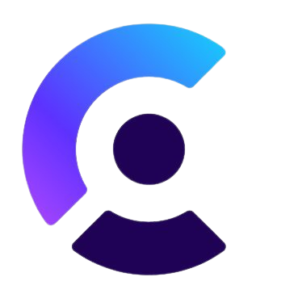

# AIdyssey
Welcome to [AIdyssey](https://aidyssey.vercel.app/), the AI-powered SaaS. Here, you can inquire, generate code snippets, images, short music compositions, and videos – all with the assistance of OpenAI and Replicate APIs. You're entitled to up to 5 free generations. After that, you'll need to subscribe to a pro plan (which is not genuine – I'll explain later how you can subscribe for free).

**WARNING: This project is purely for demonstration purposes. While all features are operational, please note that AIdyssey is not an actual company, nor is it generating any profits.**

## Features
- **Landing Page**: Users are greeted with a landing page before signing in.
- **Authentication**: Utilize [Clerk](https://clerk.com/) for authentication, including Oauth sign-up with Google, GitHub, and Discord. Also support email and password sign-up, as well as password reset functionality.
- **Dashboard**: Present users with an organized dashboard featuring a collapsible sidebar for easy navigation.
- **Content Generation**: Enable users to generate various types of content, including conversations, images, videos, music, and code snippets.
- **Free Generations**: Offer users 5 complimentary content generations, clearly displayed with a counter to track usage.
- **Subscription Plans**: Provide the option for users to subscribe to a premium plan using [Stripe](https://stripe.com/)
- **Subscription Management**: Allow users to manage their subscription through the settings page.

## Tips
- **Sign In for Dashboard Access**: Access to the dynamic dashboard, where all the exciting features are available, requires signing in.
- **Subscription for Continued Usage**: To continue enjoying uninterrupted access beyond the usage limit, it's necessary to subscribe to the pro plan.
- **Using a Fake Stripe Card**: To test the subscription process, you can employ a mock Stripe card. Feel free to use the following details:
   - 4242 4242 4242 4242
   - Any valid expiration date (for example 05/55)
   - Any name
   - Any CVV (for example 555)

## Technologies I used

## Views from the web app
    
    

